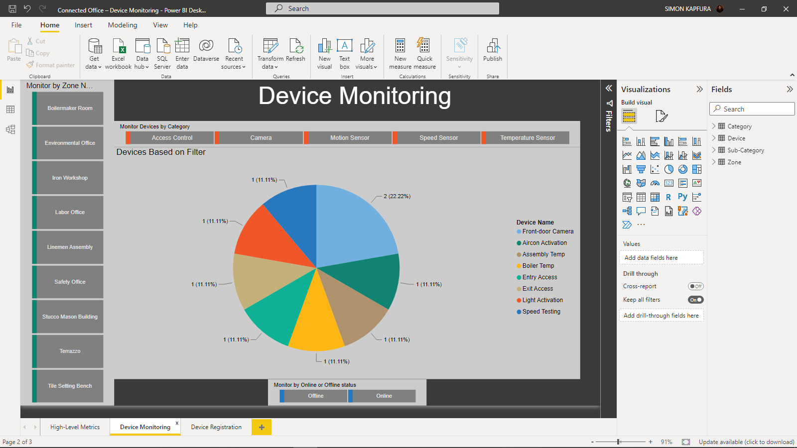
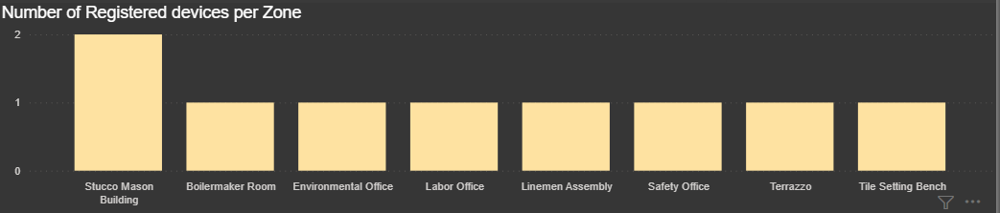

# CMPG-323-Project-5---32151314
The Connected Office Initiative (COI) encapsulates the use of IoT devices within the network,
placed all over the office building, to collect and share the data that these devices gather. The
data can be shared in different ways. One of which is through visualisations built into a report or
dashboard. These reports or dashboards can be shared with different stakeholders, potentially
with different levels of access applied. The COI have been advised that a good way to monitor
the usage of their IoT devices would be through a report.
The report will be built in Power BI, as the organisation already has all applicable licensing
agreements in place with Microsoft, and the report is expected to allow all stakeholders to see the
same information pertaining to the status of IoT device registrations on various platforms. As a
member of the COI development team, you are expected to acquire and practise the necessary
skills to create such a report

## How to use the report:
- The first page is the High Metrics Page that has the following visualizations:

- The following visual has information about the total number of each platform, total number of Zones, Categories, Devices and Sub-Categories:

- The following visual has information about the total number of devices registered each year:

- The following visual has information about the number of months each devie has been active:

- The next page is Device Monitoring, where devices can be monitored by zones, categories and online/offline status:

- The 1st section is zone, clicking any zone will show all the devices in that zone:

- Then the devices can also be monitored by category where clicking a category will show all devices under that category
- The devices can also be monitored by weteher they are online or offline as indicated in the visual below:

- The 3rd Page is Registered devices where you can see how many devices were made based on time, years and months

- The 1st section shows number of devices registered per zone:

- The 2ndtion shows number of devices created in specified month and year:

- The following visual shows information based on selected month and year, showing number of devices and categories created in each

- The pages have a filter where the information can be filtered based on Date Installed, Categories and Zones:

